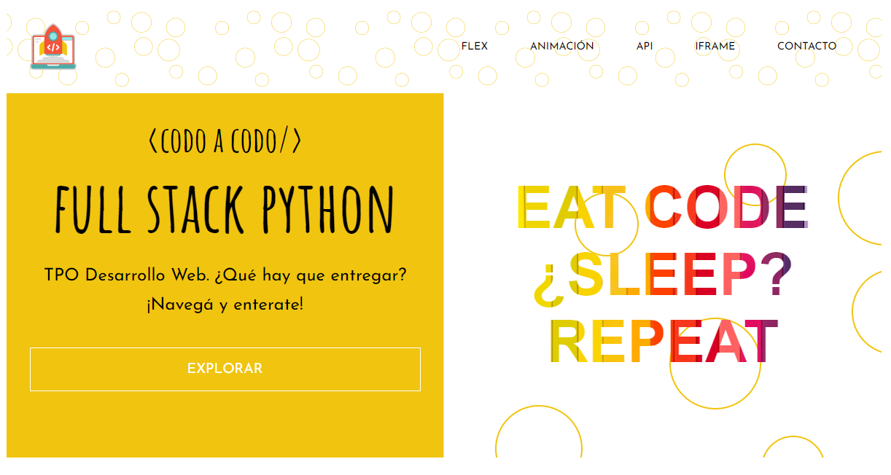

# TPO-TIENDA CODO A CODO

## Autora

 Lorena Frias

## Github repo

[FUN-TPO](https://github.com/LorenaFrias/FUN-TPO)

## Sitio Web

[FUN-TPO-CODO-A-CODO](https://fun-tpo-codo-a-codo.netlify.app/)

## Tech Stack

Client: HTML, CSS, Vanilla JavaSCript

## Estructura de carpeta

Index.html, main.js , style.css y README son los archivos en el root folder.

Se incluye además screenshot del sitio.

La carpeta assets contiene imágenes y la página de agradecimiento para formulario de contacto (thanks.html y thanks.css).